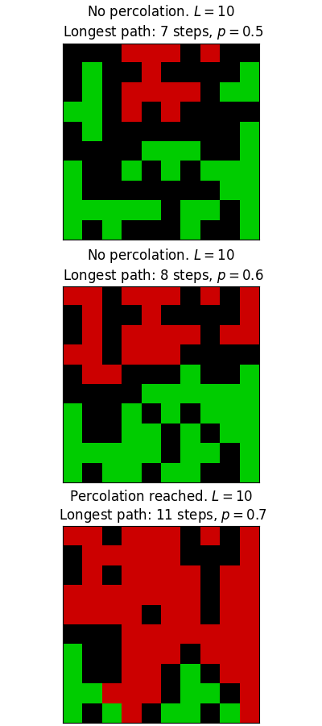
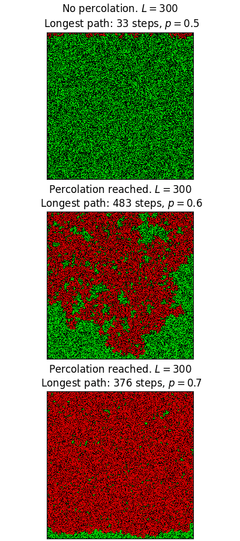
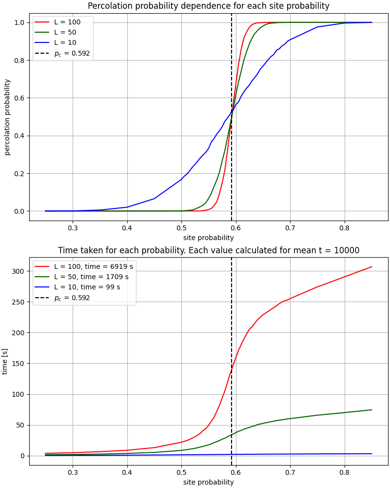
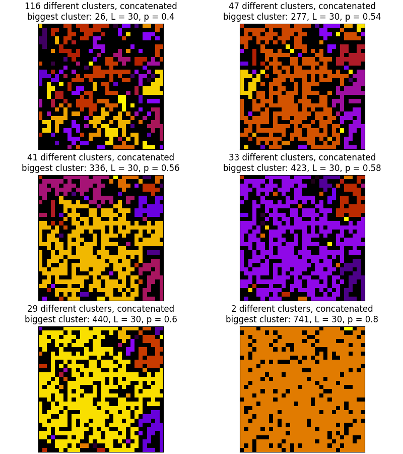

# Percolation

## Requirements

Code was developed to run on `Python 3.9.13`. All necessary packages are in [`requirements.txt`](./requirements.txt) and [`Pipfile`](./Pipfile).

## Project Structure

<ul>
    <li>Project begins in file <i>ProbabilitySite.py</i>. It contains class <i>ProbabilitySite</i> that allows to generate and visualize the 2D grid of randomly generated numbers, threshold it and change all necessary parameters.</li>
    <li>File <i>CommonFunctions.py</i> contains all functions needed to support the script, like saving and loading <i>.csv</i> files with data to visualize.</li>
    <li>Project has two main parts. The first one is <i>The Burning Model</i>. At its core it uses <i>the Burning Algorithm</i> to simulate percolation. </li>
    <li>Inside <i>BurningModel</i> directory we have three different files. 

- <i>BurningModel.py</i> has a main class <i>BurningModel</i> that inherits from <i>ProbabilitySite</i> and it allows to simulate percolation efficiently and generate data to visualize percolation probability based on site occupation probability. It has also short script that visualizes the 2D grid and saves it in <i>images</i> directory.
- <i>PercolationProbability.py</i> is a script where we can set up parameters and then it uses class <i>BurningModel</i> to generate and save data (which are located in <i>results</i> directory).
- <i>PercolationGraph.py</i> loads generated <i>.csv</i> files and plots all data on the graph and saves it in <i>images</i> directory.
</li>
    <li>The second part is <i>the Spanning Cluster</i>, which uses <i>Hoshen-Kopelman algorithm</i> to count clusters and its size,</li>
    <li>Inside <i>SpanningCluster</i> directory we have six different files.

- <i>SpanningCluster.py</i> has a main class <i>SpanningCluster</i> that also inherits from <i>ProbabilitySite</i>. Inside the class we have implemented HK algorithm that generates all cluster data in a container which is later converted to histograms. It also runs short script that visualizes found clusters on 2D grid and saves it in <i>images</i> directory.
- <i>BiggestCluster.py</i> is a script generating <i>.csv</i> file with data ready to plot the average biggest cluster in dependence of site occupation probability (data are saved in <i>results</i> directory).
- <i>BiggestClusterGraph.py</i> plots the data and saves it in <i>images</i> directory.
- <i>TimeComparisonGraph.py</i> plots the difference between two approaches of counting clusters, it also saves it to <i>images</i> file.
- <i>ClusterSizeDistribution.py</i> is a script generating data to histogram. It collects information about the quantity of all possible cluster sizes. After the simulation it saves all data in <i>.csv</i> file.
- <i>ClusterSizeDistributionGraph.py</i> reads data from above and plots it. Everything is saved in <i>images</i> directory.
</li>
    <li>Every part of the project has its own description and introduction in <i>.ipynb</i> files. Their names are:

- <i>PercolationDescription.ipynb</i>
- <i>BurningModelDescription.ipynb</i>
- <i>SpanningClusterDescription.ipynb</i>

It is recommended to read through these files in listed order.
</li>
</ul>

## Images

## Further goals

<ul>
    <li>Use less loops to speed up computation</li>
    <li>Create simple GUI to make a better way to provide parameters</li>
</ul>
